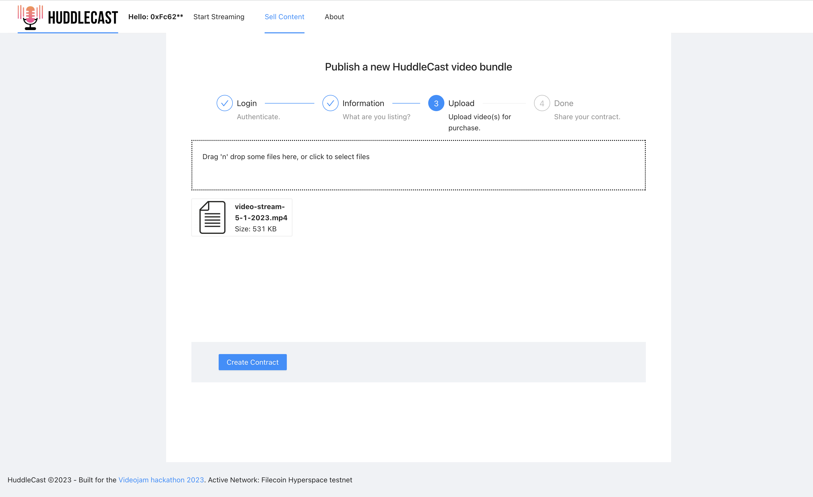
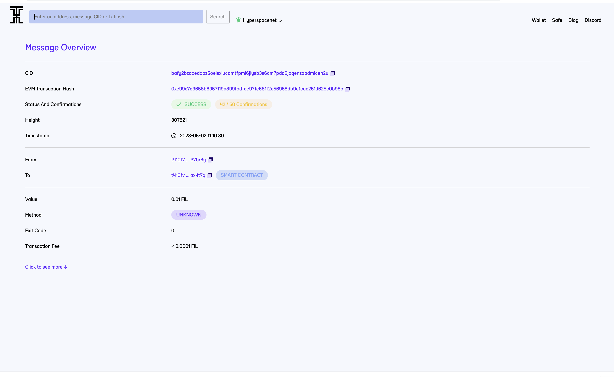
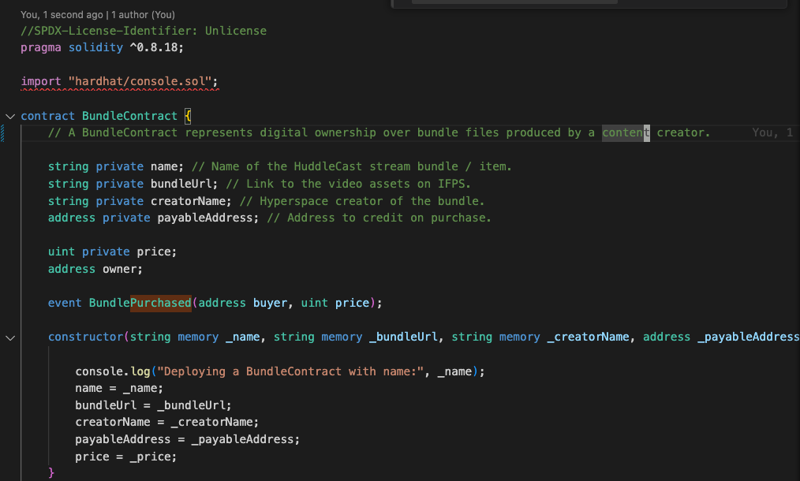

 

    

## HuddleCast

HuddleCast allows content creators to sell bundles/rights to their video or gaming content via transactable Hyperspace Filecoin smart contracts.

Each smart contract acts as a content gate where only the purchasers of the stream can access the original uploaded file resources by the content creator.

Built for the Videojam 2023 hackathon.

## Inspiration

Existing streamers often have large followings and post their content to youtube or other sites after streaming on live networks like Twitch - but that could be the end of it. Given these followings, we want to provide an opportunity to further connect with fans by providing memorabilia, and providing an additional revenue opportunity for the content creator. HuddleCast allows any streamer to turn collections of their streamed content into a purchase-able contract and IPFS video group.

These collections could potentially be resold and traded by new owners later.

Many video marketplace platforms exist, but:

- There's not a dominant one that appeals to the streaming (gaming and non-gaming) streaming market.
- May not integrate with existing streaming networks. HuddleCast doesn't care how you broadcast, only that the uploaded listings have a particular format and content.
- Have higher overhead - HuddleCast assets are backed by Filecoin and allows you to re-use existing assets and content if you wish.
- Many streamers are already into technology and can port their existing streams onto the platform, or use the natively integrated Huddle01 experience to create a group livestream and sell the video bundle directly from the app immediately after it's created.
- HuddleCast is a niche platform not focused on current categories like artwork/real estate - only video content.

<b>This project is a hackathon prototype and would require additional work / deployment to be production ready.</b>

## Setup

### Project structure

`/contracts`: Smart contracts for the HuddleCast application.
`/img`: Example screenshots.

The root directory is the client. Deploy to the Hyperspace testnet (default config).

The following environment variables are required to build HuddleCast:

<pre>
  REACT_APP_HUDDLE_PROJECT_ID= # your huddle01 project id from https://www.huddle01.com/docs/api-keys
  REACT_APP_HUDDLE_API_KEY= # your huddle01 api key used for creating new streaming rooms from the app.
  REACT_APP_STORAGE_KEY= # your web3.storage storage key for storing livestream assets on Filecoin.
</pre>

### Connecting to Hyperspace testnet

Network Name: Hyperspace Testnet
Currency Symbol: tFIL

Update `ACTIVE_NETWORK` in `constants.js` to reflect the target network for the smart contract deployments (ex: for updating to mainnet). One contract is created for each listing with a direct link to the video clip stored on IPFS.

## How we built it

- Website based on ReactJS.
- Integration with web3 using metamask and Hyperspace.
- Smart contract using Solidity supporting Hyperspace testnet/mainnet with a live demo on testnet.

## Challenges we ran into

- Integrating hyperspace networks with metamask deployer.

## Accomplishments that we're proud of

- Works and contract deploys with upload streams or video files correctly linked to Filecoin!

## Potential future work

- Monetization strategy (HuddleCast could take a fee from contract sales).
- Production deployment.

### Screenshots
<h3>Home</h3>

<h3>Specify terms of HuddleCast contract</h3>

<h3>Adding video files</h3>

<h3>Deploying contract on Hyperspace testnet</h3>

<h3>Breakpoint at contract creation</h3>

<h3>HuddleCast created!</h3>

<h3>Completing purchase via shareable payment url</h3>

<h3>Purchase transaction after confirmation</h3>

<h3>Deployed contract with purchase on Hyperspace testnet</h3>

<h3>Creating a stream on the HuddleCast app</h3>

<h3>FEVM contract code snippet</h3>

<h3>About page</h3>

<!--
Demo:

-->

Example contract: http://localhost:3000/0x36FBf31c9E4dcE0Af4b917D10a884cDC71Fb5854

### Network config

Network Name: Hyperspace Testnet
New RPC URL: https://eth-rpc-api-testnet.hyperspacetoken.org/rpc
Chain ID: 365
Currency Symbol (optional): tFIL
Block Explorer URL (optional): https://testnet-explorer.hyperspacetoken.org/

---

Network Name: Hyperspace Mainnet
New RPC URL: https://eth-rpc-api.hyperspacetoken.org/rpc
Chain ID: 361
Currency Symbol (optional): tFIL
Block Explorer URL (optional): https://explorer.hyperspacetoken.org/

### Recompiling contracts

From the `/contracts` directory:
`yarn; truffle compile`

### Useful links

- https://sersi.es/tutorial_nft_en.pdf
- https://github.com/jacobedawson/connect-metamask-react-dapp
- https://docs.hyperspacetoken.org/docs/web3-stack-metamask
